<div align="center">

# ContextHub

### Turn organizational data into a shared, explorable, AI-ready context layer.


ContextHub lets teams define their own ontologies, map heterogeneous source data into them,
and explore the resulting property graph through a visual UI, gRPC APIs, and an evolving
read-only Model Context Protocol surface.

[Quick start](#quick-start) · [Architecture](#architecture) · [Demo](#nova-commerce-demo) · [Documentation](#documentation) · [Project status](#project-status)

</div>

<p align="center">
  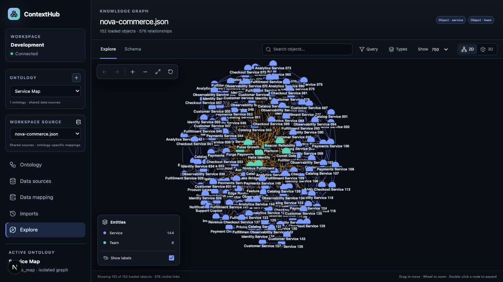
</p>

> [!NOTE]
> ContextHub is a greenfield V1 implementation inspired by the semantic modeling concepts
> of Palantir Foundry and the Rust/ClickHouse architecture of GitLab Orbit.

## Why ContextHub?

Raw records rarely contain enough meaning on their own. An AI model, analyst, or application
may see a service name, a team identifier, and a list of dependencies—but not understand how
those facts belong together.

ContextHub adds that missing semantic layer:

- **You define the model.** Object types, properties, interfaces, reusable types, links, and
  functions are not fixed by the platform.
- **Sources stay reusable.** Files, REST endpoints, and GraphQL endpoints belong to the
  workspace, while every ontology owns its interpretation of those sources.
- **Graphs stay isolated.** Published data is scoped by workspace and immutable ontology
  version, so separate ontologies never leak semantics or graph data into one another.
- **Every field remains explainable.** Property provenance links an object value back to its
  source, source field, mapping, import job, and import timestamp.
- **AI receives structured context.** The read-only MCP surface exposes schema
  discovery, object search, object lookup, and bounded graph queries to AI agents.

## Product tour

| Visual ontology modeling | Ontology-bound data mapping |
| --- | --- |
| 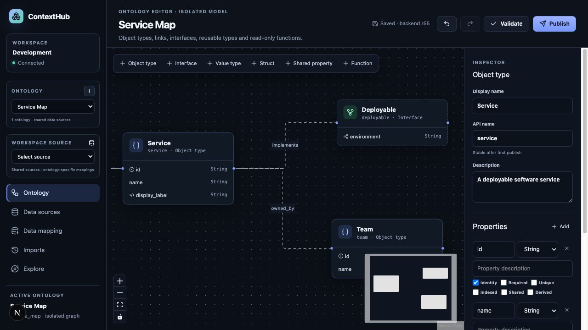 | 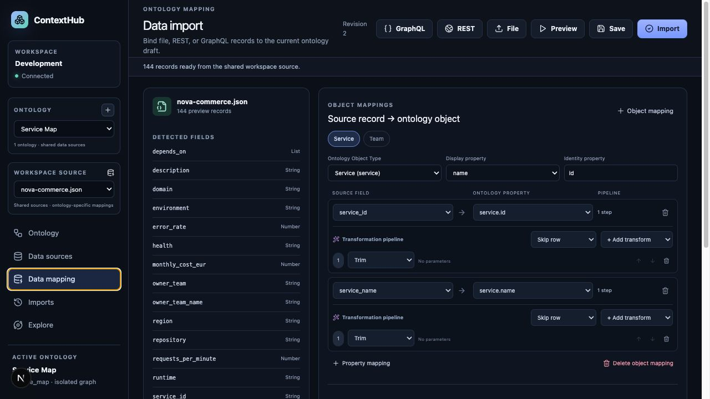 |

| Relationship mapping | Import history and provenance |
| --- | --- |
| 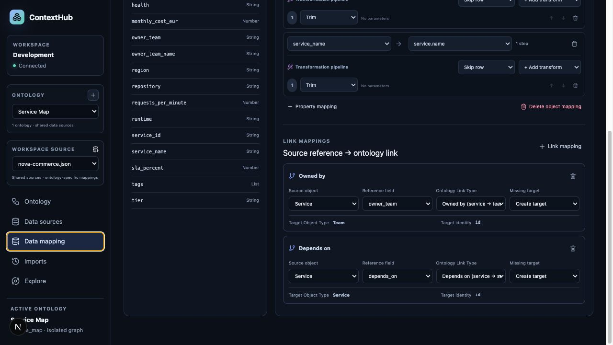 | 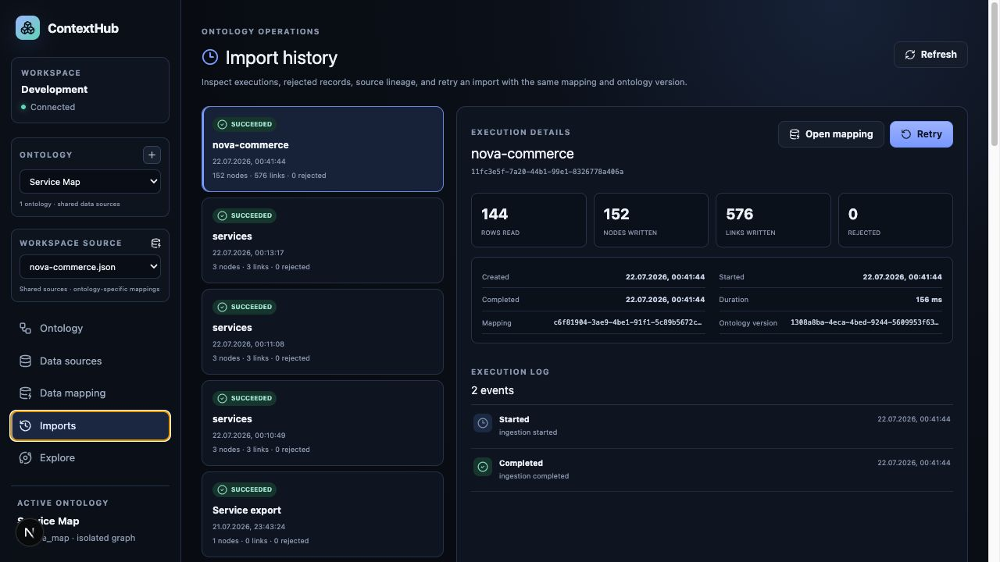 |

| Visual Graph Query Builder | Interactive 3D exploration |
| --- | --- |
| 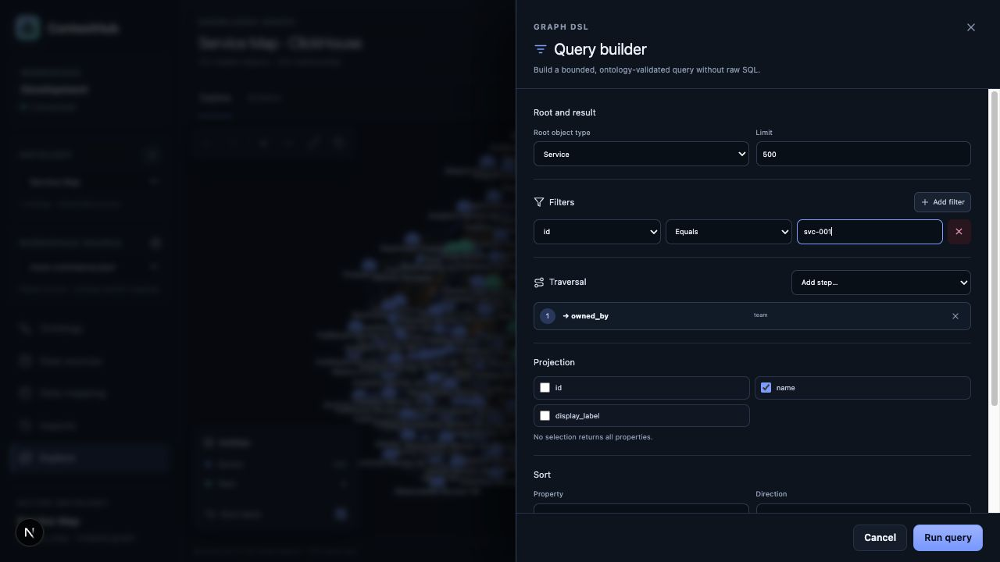 | 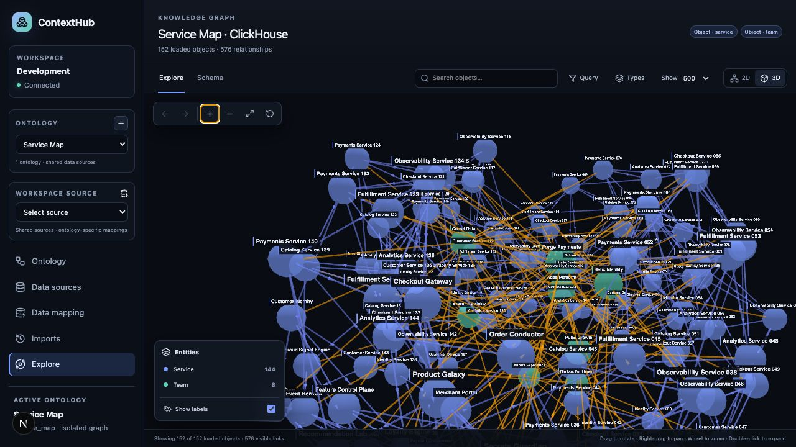 |

### From graph data to AI context

<p align="center">
  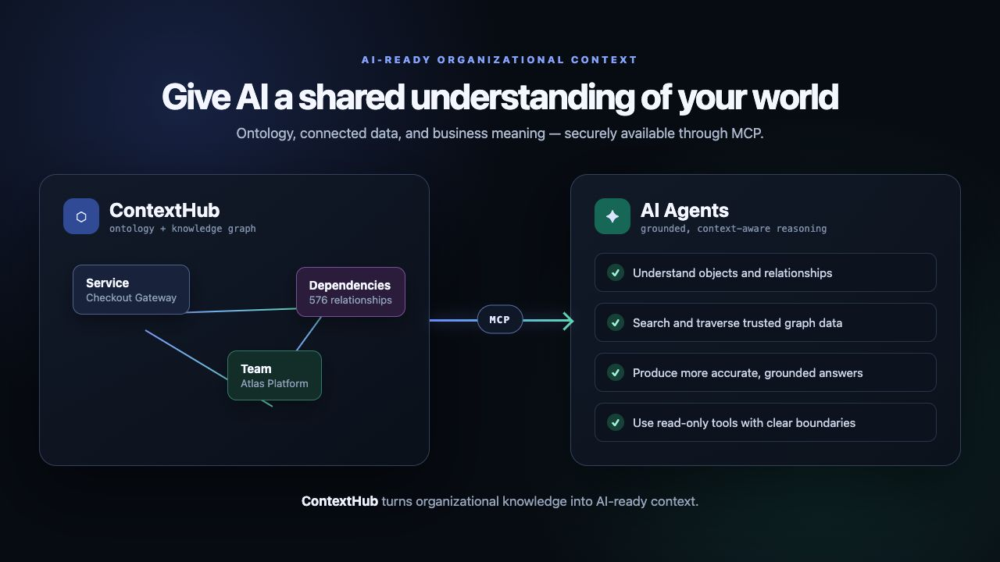
</p>

The MCP integration gives AI agents a shared understanding of objects, relationships, and
business context instead of a collection of disconnected records. Its four read-only tools use
the same gRPC services, ontology validation, workspace isolation, and persisted ClickHouse graph
as the UI. `get_ontology_schema` discovers active ontologies; every data query then requires an
explicit ontology ID, so an agent cannot accidentally mix independent graphs.

## Core capabilities

### Ontology modeling

- Object types with typed, required, unique, identity, and indexed properties
- Link types with direction, source/target types, cardinality, and link properties
- Interfaces with inheritance and multiple implementations
- Shared properties, value types, structs, enums, lists, and derived properties
- Read-only Functions using controlled expressions, external gRPC providers, or sandboxed WASM
- Optimistic draft revisions, validation, immutable publishing, and visual canvas persistence
- Multiple independent ontologies per workspace

### Data integration

- JSON, NDJSON, CSV, and Parquet uploads
- Resumable multipart uploads up to 5 GiB
- REST connectors with headers, parameters, retries, pagination, and SSRF boundaries
- GraphQL connectors with variables, record paths, and cursor pagination
- Bounded backend previews and automatic field/type detection
- Encrypted REST and GraphQL credentials using AES-256-GCM envelopes
- Shared workspace sources with revisioned, ontology-specific mapping plans

### Mapping and ingestion

- Apache Arrow as the common in-memory and streaming representation
- Apache DataFusion for restricted, ontology-aware transformations
- Ordered transforms: casts, trimming, casing, replacement, regex, defaults, coalescing,
  concatenation, arithmetic, and date/timestamp parsing
- Per-field strategies: **Skip row**, **Use null**, or **Abort import**
- Cross-object mappings and list-valued relationship expansion
- Missing-target strategies: **Create**, **Skip**, or **Error**
- Idempotent stable IDs, worker leases, fenced writes, checkpoints, and resumable batches

### Graph exploration

- 2D and 3D visualization backed by the same graph model
- Search, zoom, pan, rotation, history, type filters, and node-focused neighborhoods
- Visual filters, projections, sorting, aggregations, and directed traversals
- Parameterized ClickHouse SQL compilation—no public raw SQL endpoint
- Property-level provenance in the selected-object inspector
- Default visualization budgets of 5,000 nodes in 2D and 2,000 nodes in 3D

## Architecture

ContextHub is a monorepo with a Next.js frontend, a Rust workspace, public Protobuf contracts,
and a reproducible Devcontainer. ClickHouse is both the control plane and graph store; MinIO is
the local S3-compatible object store for uploaded source files and WASM artifacts.

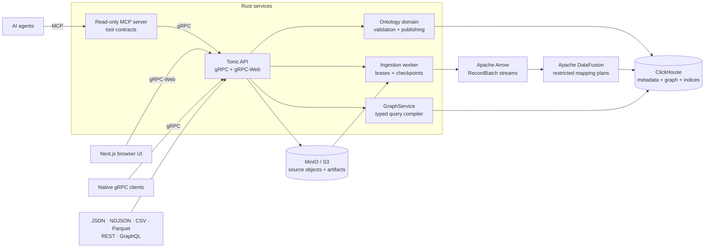

### Ingestion lifecycle

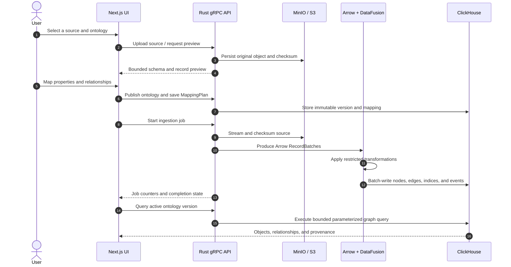

### Shared sources, isolated semantics

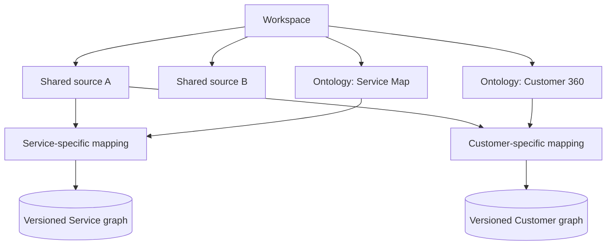

The interpretation never lives on the source itself. `ontology_data_mappings` associates a
shared source with one ontology and owns the mapping plan. Graph nodes, edges, property indices,
jobs, and provenance remain scoped to the corresponding immutable ontology version.

## Nova Commerce demo

The repository includes a deterministic fictional commerce platform designed to exercise the
entire workflow:

| Metric | Value |
| --- | ---: |
| Source records | 144 services |
| Object types | Service, Team |
| Imported graph objects | 152 |
| `owned_by` relationships | 144 |
| `depends_on` relationships | 432 |
| Total relationships | 576 |
| Rejected records | 0 |

- Dataset: [`demo/data/nova-commerce.json`](demo/data/nova-commerce.json)
- Demo guide: [`demo/README.md`](demo/README.md)
- Final narrated tour: [`context-hub-demo-tour-en-final.mp4`](demo/assets/context-hub-demo-tour-en-final.mp4)
- All screenshots: [`demo/assets/screenshots/`](demo/assets/screenshots/)

Regenerate the deterministic dataset with:

```bash
node scripts/generate-demo-data.mjs
```

## Built with Codex and GPT-5.6

ContextHub is a solo project. I used Codex, powered by GPT-5.6, as an AI development partner
throughout the build while retaining responsibility for the product direction, architecture,
technical decisions, and final review.

Codex helped me turn the initial product idea into an implementation plan, scaffold and evolve
the Rust and Next.js monorepo, implement individual features, write tests, investigate runtime
problems, and improve the documentation and demo. It was particularly useful when working across
the Protobuf, gRPC, Arrow/DataFusion, ClickHouse, React Flow, and graph-visualization boundaries,
where a change often affected several layers at once.

I also used Codex to reproduce and diagnose concrete issues rather than only generate code. This
included Devcontainer toolchain problems, Docker disk usage, ingestion and ontology-mapping bugs,
2D/3D interaction issues, and the final MCP-to-GraphService integration. Every change was checked
against the running application, automated tests, or both. GPT-5.6 and Codex accelerated the
iteration loop; the repository, its design choices, and the submitted result remain my work.

## Quick start

### Prerequisites

- Docker Desktop
- VS Code with the Dev Containers extension

The recommended setup is **Dev Containers: Reopen in Container**. The container installs the
pinned Node.js, pnpm, Rust, and Buf toolchains through `mise`; Docker Compose starts ClickHouse
and MinIO. Local development uses a fixed development identity through `AUTH_MODE=dev`, so no
separate authentication provider is required.

Inside the Devcontainer, open three terminals:

```bash
# Terminal 1 — Rust API and gRPC-Web
mise run dev:api

# Terminal 2 — read-only MCP server
mise run dev:mcp

# Terminal 3 — Next.js frontend
mise run dev:web
```

Then open:

| Service | URL |
| --- | --- |
| ContextHub UI | <http://localhost:3000> |
| gRPC / gRPC-Web | `localhost:50051` |
| MCP endpoint | <http://localhost:8080/mcp> |
| MinIO console | <http://localhost:9001> |
| ClickHouse HTTP | <http://localhost:8123> |

The MCP server connects to `http://127.0.0.1:50051` by default. Set
`CONTEXT_HUB_GRPC_ENDPOINT` when the API is available at another address. The exposed tools are
`get_ontology_schema`, `search_objects`, `get_object`, and `query_graph`.

> [!TIP]
> If `mise` is not available, verify that VS Code is attached to the Devcontainer rather than
> running the commands in a host terminal.

## Developer commands

| Command | Purpose |
| --- | --- |
| `mise run check` | Rust, frontend, Protobuf, tests, and target-size checks |
| `mise run test:e2e` | Playwright journey from upload to persisted Explorer graph |
| `mise run benchmark:graph` | Reference ClickHouse graph benchmark |
| `mise run check:target` | Warn at 8 GiB and fail at the configured Rust target limit |
| `mise run db:up` | Start ClickHouse and MinIO |
| `mise run db:down` | Stop local infrastructure |
| `cargo clean` | Reclaim generated Rust build artifacts when needed |

### Quality and scale

The reference workload contains **1,000,000 nodes and 5,000,000 edges**. The benchmark measures
concurrent property-index lookups plus one-hop and two-hop traversals and writes machine-readable
reports to `benchmark-results/`.

```bash
# Full reference workload
mise run benchmark:graph

# Smaller local smoke run
node scripts/benchmark-graph.mjs \
  --nodes=10000 \
  --edges-per-node=5 \
  --iterations=10 \
  --concurrency=4 \
  --assert
```

GitHub Actions runs Rust, frontend, Protobuf, clean ingestion E2E, and scale smoke checks.
Pull requests additionally run Buf breaking-change detection. The full reference workload runs
weekly and through manual workflow dispatch.

## Security boundaries

- Workspace and ontology-version scopes are applied to every graph operation.
- Query values are bound parameters; callers never receive raw SQL access.
- Public traversals are bounded to a maximum depth of six.
- Remote connectors reject local/private destinations, validate redirects, pin DNS answers,
  and enforce page, response-size, and timeout limits.
- Sensitive connector headers are encrypted outside public connector configuration.
- Uploaded objects are size- and SHA-256-verified while streaming.
- WASM Functions run without WASI or host imports and use memory and fuel limits.
- MCP tool annotations and graph operations are read-only; graph requests are validated by the
  same API used by first-party clients.
- Production authentication is expected to provide a JWT validator; local development uses
  `AUTH_MODE=dev` only.

## Repository map

```text
apps/web/                    Next.js 16, React 19, React Flow, 2D/3D Explorer
crates/context-hub-domain/  Ontology types, validation, and publish rules
crates/context-hub-mapping/ Mapping plans, Arrow streaming, and DataFusion execution
crates/context-hub-storage/ ClickHouse repositories and graph query compiler
crates/context-hub-api/     Tonic gRPC and gRPC-Web API
crates/context-hub-mcp/     Read-only MCP HTTP server and tool contracts
proto/                      Public Protobuf API contracts
infra/clickhouse/           Unified control-plane and graph schema
docs/                       Focused architecture and feature documentation
demo/                       Nova Commerce dataset, screenshots, and video tour
.devcontainer/              Reproducible development environment
```

## Documentation

| Topic | Document |
| --- | --- |
| Architecture and tenancy | [`docs/architecture.md`](docs/architecture.md) |
| Robust and resumable imports | [`docs/robust-imports.md`](docs/robust-imports.md) |
| Mapping transformations | [`docs/mapping-transformations.md`](docs/mapping-transformations.md) |
| Parquet imports | [`docs/parquet-imports.md`](docs/parquet-imports.md) |
| REST connectors | [`docs/rest-connectors.md`](docs/rest-connectors.md) |
| GraphQL connectors | [`docs/graphql-connectors.md`](docs/graphql-connectors.md) |
| Data-source management | [`docs/data-source-management.md`](docs/data-source-management.md) |
| Graph Query Builder | [`docs/graph-query-builder.md`](docs/graph-query-builder.md) |
| Import history and provenance | [`docs/import-history-provenance.md`](docs/import-history-provenance.md) |
| Function execution | [`docs/function-execution.md`](docs/function-execution.md) |

## Project status

| Area | Status |
| --- | --- |
| Ontology editor and immutable publishing | Implemented |
| Shared sources and ontology-specific mappings | Implemented |
| File, REST, GraphQL, and Parquet ingestion | Implemented |
| Arrow/DataFusion transformations and error strategies | Implemented |
| ClickHouse graph storage, indices, queries, and provenance | Implemented |
| 2D/3D Explorer and visual Query Builder | Implemented |
| Controlled expression, external gRPC, and WASM Functions | Implemented |
| Durable E2E, CI, and graph benchmark | Implemented |
| MCP protocol, read-only tools, and persisted GraphService integration | Implemented |
| Production JWT integration and key rotation operations | **Deployment integration** |

### Deliberate V1 boundaries

Actions, scenarios, GeoPoint/GeoShape, Attachment/MediaReference, status/render metadata,
write-capable MCP tools, direct database connectors, cross-ontology federation, and arbitrary
user SQL are intentionally excluded from V1. ConnectorX is reserved for a later direct-database
connector milestone.

---

<div align="center">

**ContextHub connects ontology, data integration, provenance, graph exploration, and AI-ready context.**

</div>
